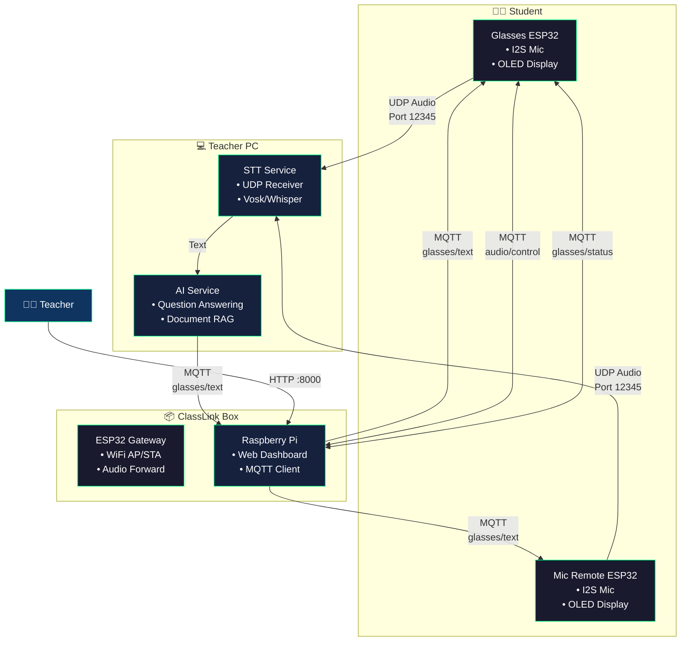

# ClassLink Audio System - Architecture

## System Overview

ClassLink Audio System là hệ thống hỗ trợ giảng dạy thông minh, cho phép học sinh đặt câu hỏi và nhận phản hồi từ AI trợ giảng.

## System Diagram



## Data Flow

### 1. Audio Uplink (Student → PC)
```
[Mic] → [I2S] → [VAD] → [UDP Packet] → [Jitter Buffer] → [STT Engine]
```
- **Format**: PCM 16-bit, 16kHz, Mono
- **Transport**: UDP with sequence number
- **VAD**: Chỉ gửi khi phát hiện giọng nói

### 2. Text Downlink (PC → Student)
```
[AI Response] → [MQTT Publish] → [Raspberry Pi] → [MQTT Forward] → [OLED Display]
```

### 3. Control Plane
```
[Web Dashboard] → [REST API] → [MQTT Publish] → [Device Control]
```

---

## Components

### Glasses (ESP32-S3)
| Function | Description |
|----------|-------------|
| Audio Capture | I2S microphone, 16kHz sampling |
| VAD | Energy-based voice detection |
| UDP Streaming | Audio packets với sequence number |
| OLED Display | Hiển thị text/AI response |
| MQTT Client | Nhận lệnh điều khiển và text |

### Mic Remote (ESP32)
| Function | Description |
|----------|-------------|
| Audio Capture | I2S microphone |
| OLED Display | 3D graphics, status display |
| Button Control | PTT (Push-to-Talk) |

### Box - ESP32 Gateway
| Function | Description |
|----------|-------------|
| WiFi AP/STA | Dual mode networking |
| UART Bridge | Kết nối với Raspberry Pi |
| Audio Forward | Relay UDP nếu cần |

### Box - Raspberry Pi
| Function | Description |
|----------|-------------|
| Web Dashboard | FastAPI, port 8000 |
| MQTT Client | Bridge giữa PC và devices |
| WiFi Config | Captive portal setup |

### PC - STT Service
| Function | Description |
|----------|-------------|
| UDP Receiver | Nhận audio từ devices |
| Jitter Buffer | Xử lý packet loss/reorder |
| STT Engine | Vosk hoặc Whisper |

### PC - AI Service  
| Function | Description |
|----------|-------------|
| Question Answering | Trả lời câu hỏi học sinh |
| Document Processor | RAG với tài liệu giáo viên |
| Subject Mode | Tự nhiên / Xã hội |

---

## AI Processing Pipeline

Hệ thống sử dụng **2 AI riêng biệt** với nhiệm vụ khác nhau:

```
┌─────────────────────────────────────────────────────────────────┐
│                     LUỒNG XỬ LÝ TEXT                            │
├─────────────────────────────────────────────────────────────────┤
│                                                                 │
│  Học sinh nói → Mic Glasses → STT (raw text, có thể lỗi)        │
│                                    ↓                            │
│                         ┌─────────────────────┐                 │
│                         │ AI HỖ TRỢ GIÁO VIÊN │                 │
│                         │                     │                 │
│                         │ 1. Sửa lỗi STT      │                 │
│                         │ 2. Chuẩn hóa số/ký  │                 │
│                         │    hiệu theo mode   │                 │
│                         │ 3. Lọc nội dung     │                 │
│                         │    nhạy cảm         │                 │
│                         └─────────────────────┘                 │
│                                    ↓                            │
│                            Text sạch, chuẩn                     │
│                                    ↓                            │
│                         ┌─────────────────────┐                 │
│                         │   AI TRỢ GIẢNG      │ ← Chỉ nhận text │
│                         │                     │   sạch, không   │
│                         │   Giảng giải bài    │   lo xử lý lỗi  │
│                         │   cho học sinh      │                 │
│                         └─────────────────────┘                 │
│                                                                 │
└─────────────────────────────────────────────────────────────────┘
```

### AI Hỗ Trợ Giáo Viên (Text Preprocessing)
| Nhiệm vụ | Mô tả | Ví dụ |
|----------|-------|-------|
| Sửa lỗi STT | Chỉnh lỗi nhận dạng giọng nói | "tầy ơi" → "thầy ơi" |
| Chuẩn hóa số (Tự nhiên) | Chuyển chữ → số/ký hiệu | "hai cộng ba" → "2 + 3" |
| Giữ nguyên (Xã hội) | Không đổi text chữ | "hai cộng ba" → "hai cộng ba" |
| Lọc nội dung | Chặn nội dung nhạy cảm | [Đã chặn] |

### AI Trợ Giảng (Question Answering)
| Nhiệm vụ | Mô tả |
|----------|-------|
| Nhận text sạch | Chỉ xử lý text đã được AI Hỗ Trợ GV làm sạch |
| Giảng giải | Trả lời câu hỏi, giải thích bài học |
| RAG | Tham chiếu tài liệu giáo viên upload |

**Lợi ích thiết kế 2 AI:**
1. Mỗi AI tập trung một nhiệm vụ cụ thể
2. AI Trợ Giảng nhận text sạch → phản hồi chính xác hơn
3. Dễ debug và bảo trì từng thành phần

---

## Protocol Summary

| Protocol | Port | Purpose |
|----------|------|---------|
| UDP | 12345 | Audio streaming |
| MQTT | 1883 | Control & Text |
| HTTP | 8000 | Web Dashboard |
| UART | - | ESP32 ↔ Raspberry Pi |

See [protocol/](protocol/) for detailed specifications.
