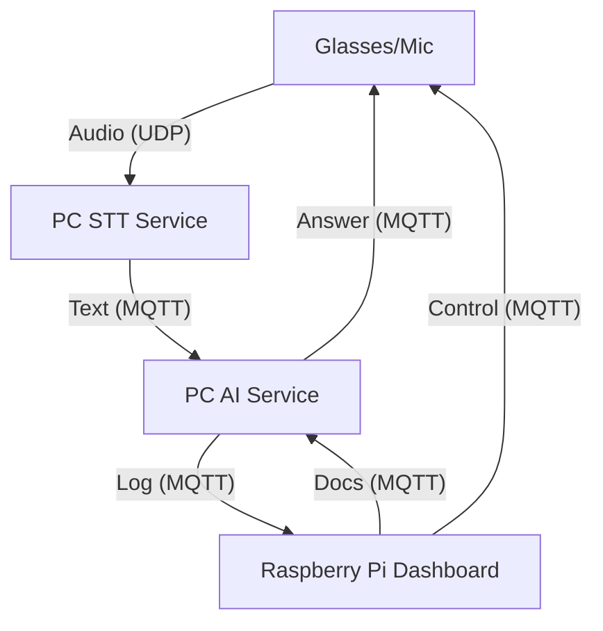

# ClassLink Audio System

Hệ thống hỗ trợ giảng dạy thông minh sử dụng AI và thiết bị đeo (Smart Glasses).

## 🏗️ Kiến trúc hệ thống

Hệ thống bao gồm 3 thành phần chính hoạt động phối hợp qua giao thức MQTT và UDP:

1.  **Raspberry Pi (The Box - AI Core)**: 
    *   Trung tâm điều khiển.
    *   Cung cấp Web Dashboard (Port 8002).
    *   Lưu trữ lịch sử bài giảng và transcription.
    *   Cầu nối (Bridge) giữa phần cứng ESP32 và phần mềm AI trên PC.
2.  **PC AI Service**:
    *   Xử lý Speech-to-Text (STT) tiếng Việt.
    *   Tích hợp Google Gemini AI để làm Trợ giảng (AITeachingAssistant).
    *   Hỗ trợ trích xuất kiến thức từ tài liệu (PDF, DOCX, TXT).
3.  **Hardware (ESP32)**:
    *   **Glasses**: Kính thông minh có Micro thu âm và màn hình OLED hiển thị phản hồi của AI.
    *   **Mic Remote**: Micro cầm tay dành cho giáo viên, hỗ trợ giảng bài và hỏi AI nhanh.

### Sơ đồ luồng dữ liệu (Data Flow)


## 🚀 Hướng dẫn cài đặt nhanh

### 1. Raspberry Pi (Cổng 8002)
```bash
cd "ClassLink Audio System/box/raspberry/api"
pip install -r requirements.txt
# Cấu hình tại app/config.yaml (Broker, Port, WiFi)
python -m uvicorn app.main:app --host 0.0.0.0 --port 8002
```

### 2. PC AI Service
*   Yêu cầu: Python 3.9+, [Gemini API Key](https://aistudio.google.com/).
*   Cài đặt:
    ```bash
    cd "ClassLink Audio System/pc/ai_service"
    pip install -r requirements.txt
    python main.py
    ```

### 3. ESP32 (Firmware)
*   Sử dụng PlatformIO để nạp code từ thư mục `glasses` và `mic_remote`.
*   Cấu hình WiFi mặc định: SSID `CLASS-BOX`, Pass `12345678`.

## 📈 Trạng thái hiện tại
- [x] **Document Upload**: Tải tài liệu bài giảng và học liệu.
- [x] **Real-time Dashboard**: Theo dõi thiết bị, pin và transcription.
- [x] **WiFi Manager**: Công cụ cấu hình mạng AP/Client cho Box.
- [x] **AI Assistant**: Trợ giảng thông minh tích hợp Gemini.

---
*Phát triển bởi ClassLink Team - 2026*
